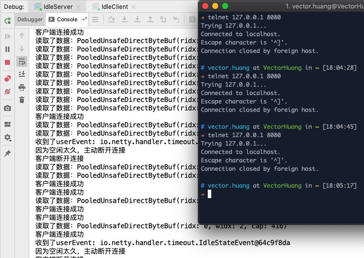
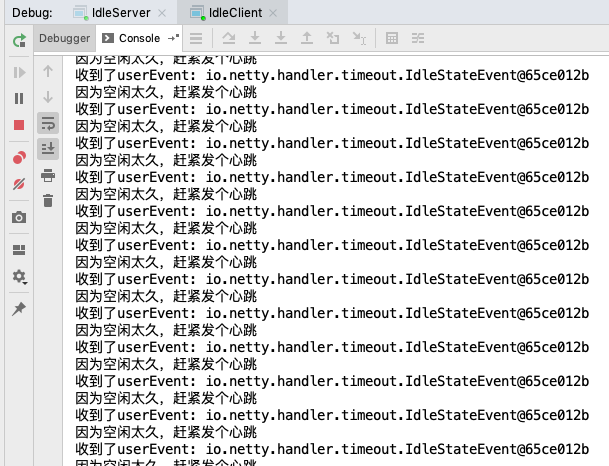

## 空闲测试

### 服务端

当90 秒，还是读还是空闲着，那么就发出userEvent，请求断开Channel

### 客户端

当60 秒，还是写还是空闲着，那么就发送一个心跳给服务端

### 测试1

运行IdleServer，使用telnet 127.0.0.1 8080 连接

一定时间后，终端不发送内容，就会被断开

### 测试2

运行IdleServer，运行IdleClient

会一直运行下去。

